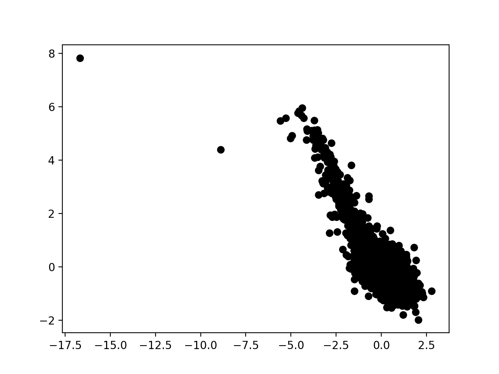
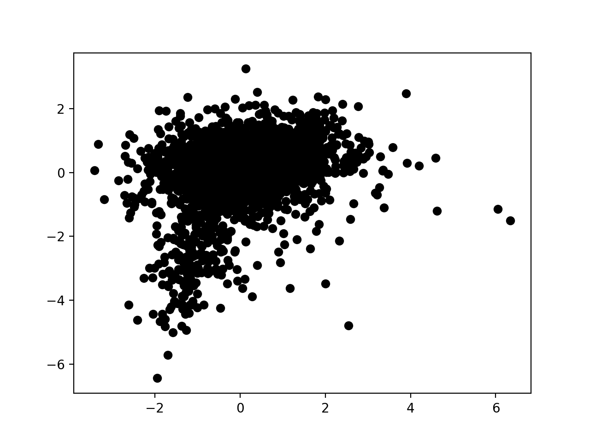
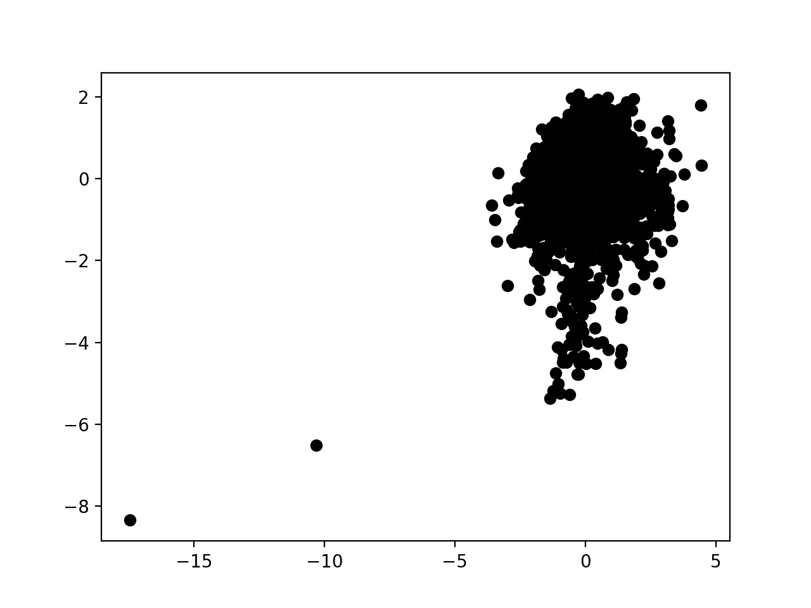
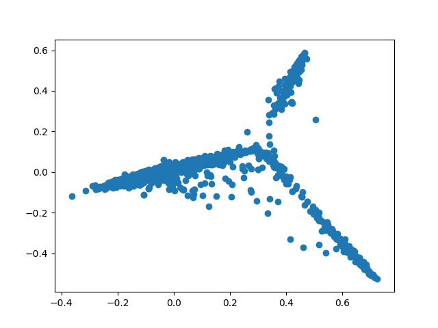

# Lyricistics
Contrary to the features most music streaming services offer by categorizing and recommending songs according to genre, the idea behind Lyricistics emerged from the desire to try something different. Instead, this post illustrates our experimentation with machine learning techniques that will make music recommendations according to analysis of the content and meaning behind song lyrics. The procedure is simple: request a recommendation upon listening to a song you enjoy for its lyrical sentiment, and the search will (hopefully) yield a list of songs sharing a similar style of lyrics to it.

The intricacies behind its development are fascinating; along with the results. We decided to use Genius, as despite its limitations, its provision of not only lyrics but line-by-line annotations gave us a larger training set to work with, although we constrainted our selection of song lyrics to earlier, almost exclusively hip-hop/rap songs in the belief that they would have the most thorough annotations overall. To achieve this, we wrote a script using JavaScript to scrape the Genius database of 25000 lines (approx. 6000-6500 songs), building a dataset. We used the bag of words model to find features and 'vectorize' our lyrics and annotations, allowing us to blur the lines between annotations and lyrics and combine both elements as part of the data set. The idea behind the vector representations is that they will capture some semantic information about the words they represent, since they are dependent on the context the word occurs in, and words occurring in similar contexts will have similar vectors. Additionally, we initially planned on incorporating NLP (Natural Language Processing) to compress lyrics to only a summary (to reduce the word count) using the SMMRY algorithm, but some patterns rap songs displayed (especially their generous usage of stop words in order to further express themselves) convinced us otherwise. As such, we left all songs the way they were (and are).

The next step was then to use unsupervised machine learning algorithms to explore the database of hip-hop songs we collected. We fed data to a Doc2Vec (a variant of Word2Vec oriented towards paragraphs/collections of words) based neural network, as well as a KNN cluster that used principal component analysis to reduce dimensionality. On the neural network, we found that the accuracy and positioning of recommendations was highly dependent on the length of the query and word overlap. As for the KNN cluster, we observed that data separated into three visible clusters. Several anomalies were present in both forms of analysis, which were likely either songs written in foreign languages or unusually terse or short songs.

<i>Fig. 1-3: Graphs of neural network training vector clusters produced during three different runs</i>

<i>Fig. 4: Graph of KNN clustering algorithm</i>

